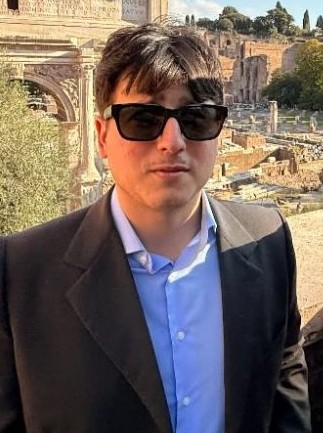

 

---

## Profile

### IT:
_Enrico Maria Bufacchi_ è un teorico, saggista, scrittore e studente di matematica teorica presso il dipartimento di matematica "Guido Castelnuovo" _dell'Università La Sapienza di Roma_.

Questo sito è una _publicatio_ che raccoglie i suoi _paper_ di ricerca scientifica matematico-fisica e i suoi scritti di teorie, teoresi, studi e saggi di filosofia teoretica, storia della filosofia, logica, teologia, antropologia, sociologia e politica.

### ENG:
_Enrico Maria Bufacchi_ is a theorist, essayist, writer and student in theoretical mathematics at the 'Guido Castelnuovo' Department of Mathematics, _Sapienza University of Rome_.

This website is a _publicatio_ that collects his mathematical-physical scientific research papers and his writings of theories, _theoresis_, studies and essays in theoretical philosophy, history of philosophy, logic, theology, anthropology, sociology, and politics.

 

---

## Works

---

## ATTENZIONE: SITO IN MANUTENZIONE. ALCUNI PDF NON SARANNO MOMENTANEAMENTE DISPONIBILI.

## PROSSIME PUBBLICAZIONI: 

* [**Bufacchi, E.M. Fondamenti di Filosofia Antica (PDF)**]

---

### Theoretical Essays

[...]

 

### _Theoresis_ and Studies

* [**Bufacchi, E.M. Teoria sulla non-definibilità ontologica della libertà (PDF)**](Bufacchi_EM_Teoria_sulla_non_definibilità_ontologica_della_libertà.pdf)

[...]

 

### Mathematics and Physics Research Papers

* [**Bufacchi, E.M. Green-Griffiths-Lang Conjecture (PDF)**](Bufacchi_EM_GGL_Conjecture.pdf)

---

## Contacts

**[enrico03.bufacchi@gmail.com]**

---

## Comments

---

## License

 
The original works present in this archive, unless otherwise specified, are licensed under a <a rel="license" href="http://creativecommons.org/licenses/by-nc-nd/4.0/">Creative Commons Attribution - NonCommercial - NoDerivatives 4.0 International License</a>.
 
© 2025 Enrico Maria Bufacchi. (All rights reserved where not otherwise specified)
